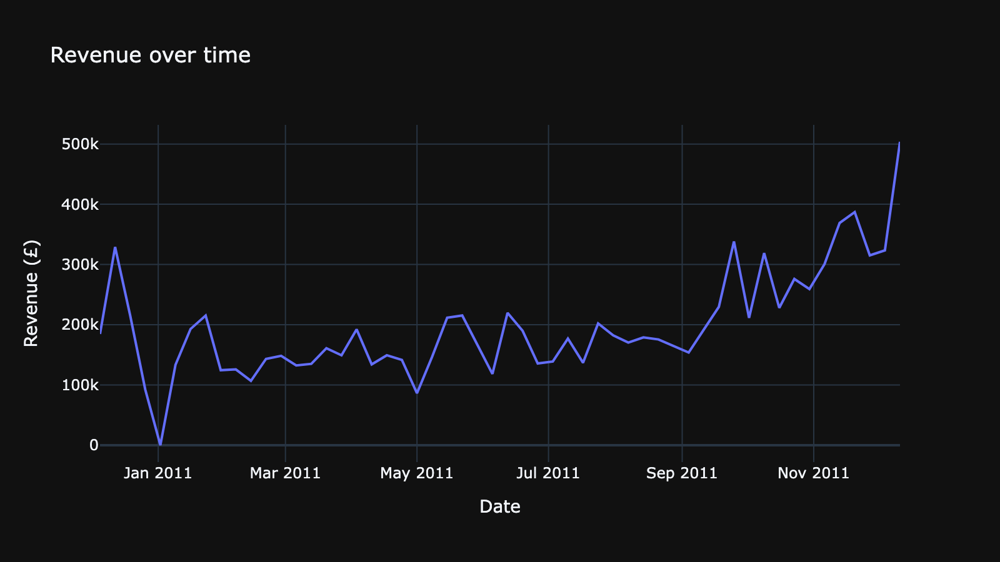
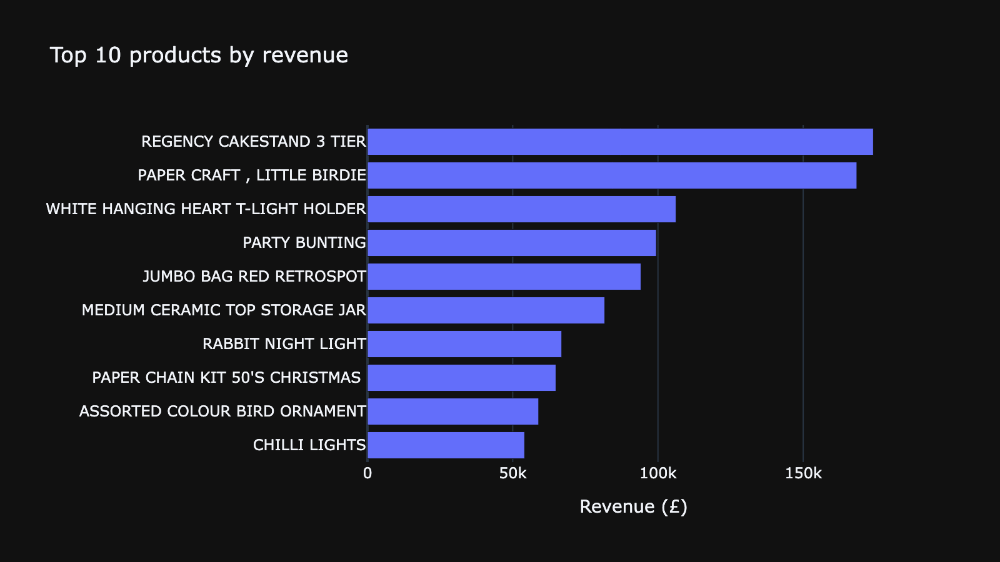

# Sales KPI Dashboard

**Live demo:** <!-- TODO(Lennard): Link nach Streamlit-Community-Cloud-Deployment hier eintragen --> _(not yet deployed)_

An interactive Streamlit dashboard for UK online retail sales data — filter by date, country, or product and watch 5 KPI cards and 3 charts update live.



Second of a three-part series on the same dataset: [static exploratory analysis](https://github.com/Tanos3000/sales-performance-analysis) → interactive dashboard (this repo) → [natural-language query agent](https://github.com/Tanos3000/ai-data-analysis-agent).

## Problem / Motivation

The [sales-performance-analysis](https://github.com/Tanos3000/sales-performance-analysis) project answered fixed business questions in a static notebook. But stakeholders rarely want just one predefined view — they want to slice the data themselves ("show me just Germany", "what did November look like?"). This dashboard turns that same dataset into something a non-technical person can explore on their own, live.

## Key Features

- **5 live KPI cards**: total revenue, orders, customers, average order value, units sold — recalculated instantly for whatever filter combination is active.
- **3 filters**: date range, country, and product (top 30 by revenue) — combinable, and all optional.
- **3 interactive charts**: revenue trend (auto-switches between daily/weekly resolution depending on the selected range), top 10 products, and revenue by country.
- **Self-contained deployment**: downloads its own dataset on first run, so it works out of the box on Streamlit Community Cloud without any manual setup step.



## Tech Stack

- Python 3, pandas
- Streamlit for the UI, Plotly for interactive charts
- Data source: UCI Online Retail Dataset (same as sales-performance-analysis)
- Deployment: Streamlit Community Cloud

## How it works

```
download_data.py  -> fetches the raw Excel file (auto-runs on first app load if missing)
data_prep.py       -> cleans it (same logic as sales-performance-analysis, plus one
                       extra fix: an "Adjust bad debt" row that isn't a real sale)
app.py             -> Streamlit UI: sidebar filters -> filtered DataFrame -> KPI cards + charts
```

Filtering happens once, near the top of `app.py`; every KPI and chart below reads from that same `filtered` DataFrame, so there's exactly one place that defines what "the current view" means.

## Getting Started

```bash
git clone https://github.com/Tanos3000/sales-kpi-dashboard.git
cd sales-kpi-dashboard
python3 -m venv venv
source venv/bin/activate
pip install -r requirements.txt

streamlit run app.py    # downloads the dataset automatically on first run
```

### Deploying to Streamlit Community Cloud

The app is already deployment-ready: no absolute paths, and `download_data.py` fetches the dataset on first run so there's no manual data setup step.

1. Push this repo to GitHub (already done).
2. Go to [share.streamlit.io](https://share.streamlit.io) → **New app**.
3. Select this repository, branch `main`, main file path `app.py`.
4. Deploy. First load takes a bit longer while the dataset downloads.

## Data Source

[UCI Online Retail Dataset](https://archive.ics.uci.edu/dataset/352/online+retail) — 541,909 real transactions from a UK-based online gift retailer, December 2010 to December 2011. Public domain.

## What I learned

Building the same dataset a second time, as an app instead of a notebook, actually caught a real bug: a single "Adjust bad debt" accounting entry worth £11,062 had been silently counted as revenue in my first project, because I never checked why one row had a different data type than all the others. Reusing the "same" cleaning logic in a new context is a good way to find mistakes the first pass missed. I also learned that browser-based UI testing has its own quirks unrelated to the app itself — some Streamlit widgets were harder to drive from an automated browser than others, which is a good reminder that automated testing and real user interaction aren't always identical.
